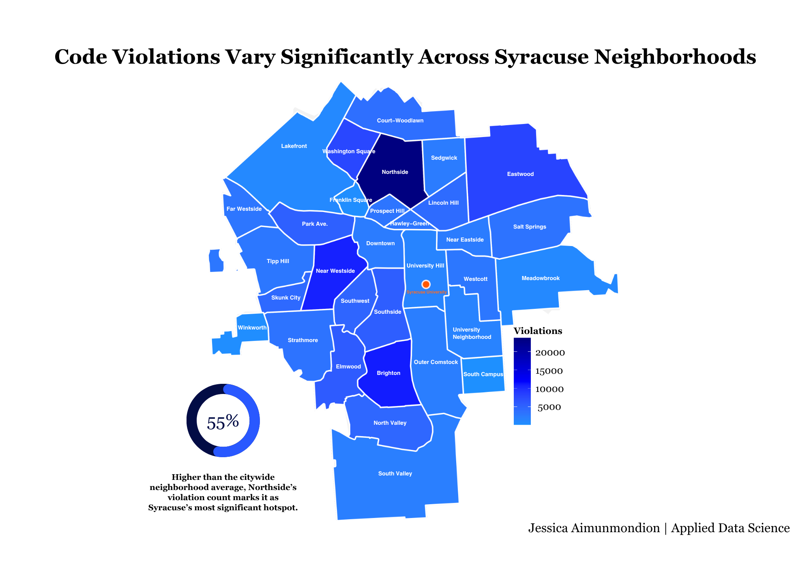
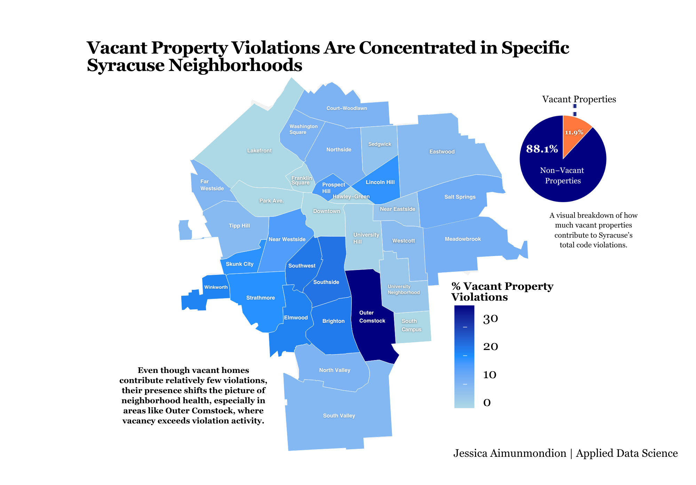
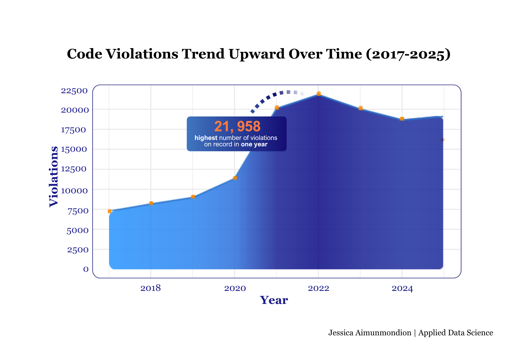
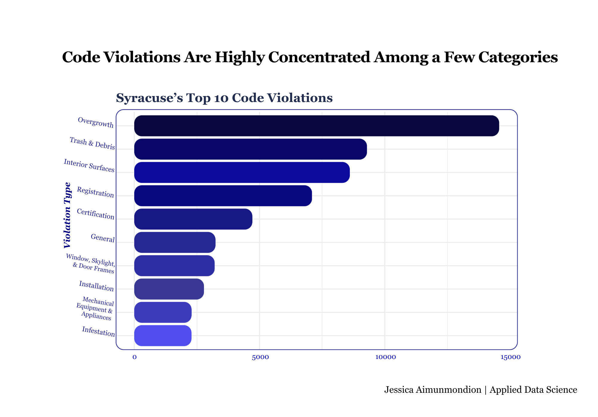
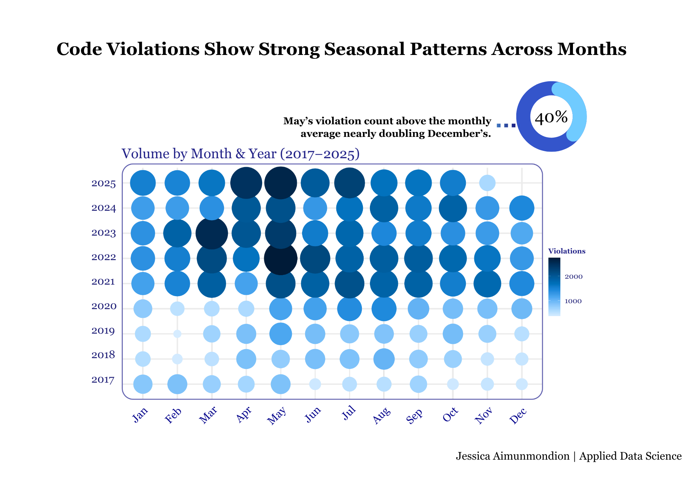

# Visualizations

This folder contains the key visualizations from the Syracuse Housing Code Violations analysis.

---

## Code Violations Vary Significantly Across Syracuse Neighborhoods

Shows how violations are unevenly distributed, with certain neighborhoods experiencing significantly higher activity.

---

## Most Code Violations Occur in Occupied Properties

Demonstrates that the majority of violations come from occupied properties, though vacancy still plays a role in housing conditions.

---

## Code Violations Rise Before Leveling Off

Shows how violations increased over time before stabilizing, with a peak around 2022.

---

## A Small Number of Violation Types Drive Most Housing Issues

Identifies the most common violations, including trash, overgrowth, and structural issues.

---

## Code Violations Show Strong Seasonal Patterns Across Months

Reveals seasonal patterns, with violations peaking in late spring and summer months.
